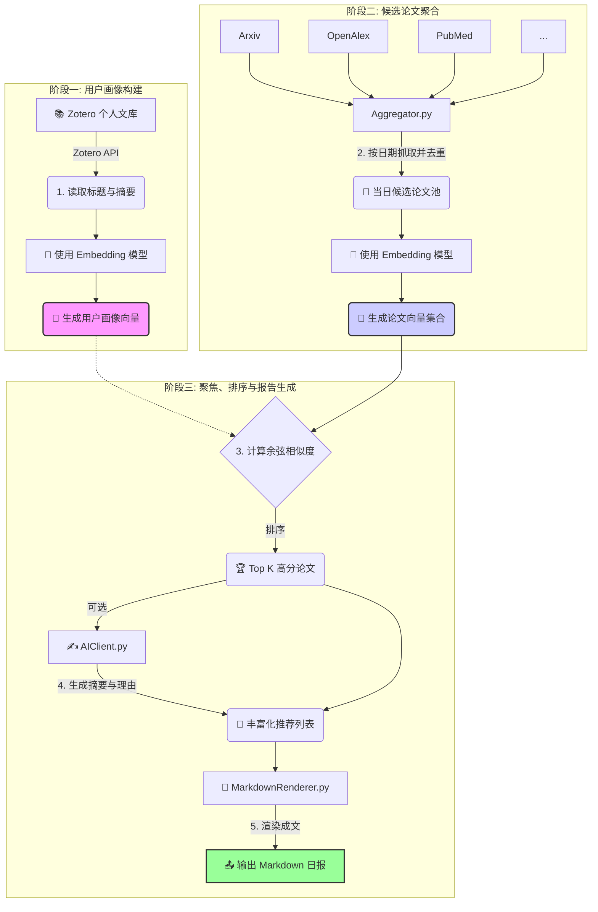

# PaperLens: AI 驱动的个性化学术论文透镜

[](https://www.python.org/)
[](https://opensource.org/licenses/MIT)
[]()

**PaperLens** 是一款为你量身打造的自动化科研利器，它如同一面智能透镜，能为你从浩如烟海的学术文献中聚焦出最有价值的前沿动态。项目通过深度分析你的 Zotero 文库来构建个性化研究画像，每日自动从全球十余个主流学术数据库中聚合最新论文，并利用前沿的向量嵌入技术精准筛选、排序，最终生成一份包含 AI 摘要和推荐理由的精致日报，让你轻松洞察与研究方向最契合的学术精华。

---

## 🚀 核心特性

-   **🎯 深度个性化**: 通过 Zotero API 学习您的阅读品味，精准捕捉您的研究兴趣，让每一次推荐都直击核心。
-   **🌐 多源聚合与去重**: 一网打尽 arXiv, OpenAlex, PubMed 等十余个主流学术平台最新论文，并通过智能算法自动去重，确保信息全面且无冗余。
-   **💡 智能向量排序**: 采用 Google Gemini 等顶级嵌入模型，将复杂的学术内容向量化，通过计算语义相似度，实现远超关键词匹配的精准排序。
-   **✍️ AI 增强阅读 (可选)**: 集成强大的 Gemini Pro 模型，为每篇顶级推荐自动生成凝练的核心摘要和“为您推荐”的个性化理由，极大提升筛选效率。
-   **⚙️ 配置高度灵活**: 所有 API 密钥、数据源开关、模型选择等均通过 `Config.yaml` 文件统一管理，无需修改任何代码即可轻松定制。
-   **📅 自动化工作流**: 设计为每日自动运行，可轻松部署为 Cron Job 或 GitHub Action，实现“一次配置，每日享用”的自动化体验。
-   **🧩 模块化易扩展**: 遵循清晰的 `Source` 接口设计，添加新的学术数据源仅需简单几步，为系统未来的成长提供了无限可能。

---

## 🔬 技术架构与工作流

**PaperLens** 的核心是一个自动化的数据处理流水线（Pipeline），它将用户画像构建、数据抓取、智能排序和内容生成等步骤有机地串联起来。



1.  **用户画像构建**: (`Pipeline.py`)
    -   系统通过 `Config.yaml` 中配置的 Zotero `USER_ID` 和 `API_KEY`，请求 Zotero API。
    -   获取您文库中所有项目的标题（title）和摘要（abstractNote）。
    -   将这些文本合成为一份能代表您研究兴趣的“语料库”。
    -   调用 `Embedder.py`，将这份语料库编码成一个高维向量，即**用户画像向量 (Profile Vector)**。这个向量是后续所有推荐的核心基准。

2.  **候选论文聚合**: (`FetchPaper/Aggregator.py`)
    -   `Aggregator` 调度所有在 `SourcesRegistry.py` 中注册并启用的 `*Source.py` 模块。
    -   每个模块根据指定的日期（`day`）向对应的学术平台 API 发起请求，抓取当天发表的论文。
    -   `Aggregator` 收集所有来源的结果，并根据论文的 DOI、ID 或标题进行智能去重，形成**候选论文池**。
    -   再次调用 `Embedder.py`，将池中每篇论文的标题和摘要编码成独立的**论文向量**。

3.  **智能排序与聚焦**: (`Pipeline.py`)
    -   计算**用户画像向量**与池中每一个**论文向量**之间的余弦相似度。
    -   相似度得分越高，代表该论文与您的研究兴趣越契合。
    -   根据得分从高到低排序，并选取 `TOP_K`（在 `Config.yaml` 中配置）篇论文作为最终推荐，实现“聚焦”效果。

4.  **AI 增强 (可选)**: (`AIClient.py`)
    -   如果 `AI_ENABLE` 为 `true`，系统会将 Top K 论文的元数据发送给 Gemini Pro 模型。
    -   通过精心设计的 Prompt，引导 AI 为每篇论文生成一段凝练的摘要和一句个性化的推荐理由。

5.  **报告生成**: (`MarkdownRenderer.py`)
    -   将处理好的推荐列表（包含标题、链接、来源、相似度得分、AI摘要等信息）渲染成一个结构清晰、阅读友好的 Markdown 文件。
    -   文件以日期命名（如 `daily_2023-10-27.md`）并保存在 `outputs/` 目录下。

---

## 📂 项目结构

```
.
├── Config.yaml                # 🔑 主配置文件，所有密钥和参数都在这里！
├── main.py                    # 🚀 项目入口脚本
├── requirements.txt           # 📦 Python 依赖库列表
├── outputs/                   # 📄 生成的 Markdown 报告存放目录
└── sources/                   # 核心代码模块
    ├── Pipeline.py            # 🧠 业务流程编排器，串联所有步骤
    ├── ConfigLoader.py        # ⚙️ 负责加载和解析 Config.yaml
    ├── AIClient.py            # 🤖 Gemini 生成模型的客户端 (用于摘要)
    ├── Embedder.py            # ✨ Gemini 嵌入模型的客户端 (用于向量化)
    ├── MarkdownRenderer.py    # 📝 渲染最终 Markdown 报告
    ├── Mailer.py              # 📧 (可选) 邮件通知服务
    └── FetchPaper/            # 🕸️ 数据抓取模块
        ├── Source.py          # 📜 所有数据源必须遵守的抽象基类 (接口)
        ├── Aggregator.py      # 🏗️ 聚合、调度所有数据源并去重
        ├── SourcesRegistry.py # 📚 注册中心，管理所有可用的数据源
        ├── SourcesConfig.py   # 🎛️ 加载数据源特定的配置
        └── *Source.py         # 🔌 每个学术数据源的具体实现 (如 ArxivSource.py)
```

---

## ⚡️ 快速开始

### 1. 环境准备

-   **Python**: 确保您的环境中已安装 Python 3.9 或更高版本。
-   **Git**: 用于克隆本项目。
-   **API 密钥**:
    -   **Zotero API Key**:
        1.  登录 [Zotero 官网](https://www.zotero.org/)。
        2.  访问 `Settings -> Feeds/API` 页面 (`https://www.zotero.org/settings/keys`)。
        3.  点击 "Create new private key"，为密钥命名（如 "PaperLens"），并授予其**读权限**即可。
        4.  **您的 User ID** 就在该页面的提示信息 "Your user ID for API calls is XXXXXX" 中。
    -   **Google Gemini API Key (可选)**:
        1.  访问 [Google AI Studio](https://makersuite.google.com/)。
        2.  点击 "Get API key" 并创建一个新的 API 密钥。

### 2. 安装步骤

1.  **克隆仓库到本地**:
    ```bash
    git clone https://github.com/your-username/PaperLens.git
    cd PaperLens
    ```

2.  **创建并激活 Python 虚拟环境** (推荐):
    ```bash
    # Windows
    python -m venv venv
    venv\Scripts\activate

    # macOS / Linux
    python3 -m venv venv
    source venv/bin/activate
    ```

3.  **安装所有依赖**:
    ```bash
    pip install -r requirements.txt
    ```

### 3. 配置指南

项目的所有配置都集中在 `Config.yaml` 文件中。请将 `Config.yaml.example` (如果存在) 复制为 `Config.yaml`，或从头创建，并根据以下说明填写：

```yaml
run:
  # 目标日期。留空表示自动获取 UTC 时间的昨天。也可手动指定，如 "2023-10-27"。
  TARGET_DATE: ""
  # 最终报告中推荐的论文数量。
  TOP_K: 50
  # 使用的嵌入模型。推荐 "models/embedding-001"。
  EMBEDDING_MODEL: "models/embedding-001"
  # 是否启用 AI 生成摘要和理由。需要有效的 GEMINI_KEY。
  AI_ENABLE: true

zotero:
  # 您的 Zotero User ID (纯数字)。
  ZOTERO_USER: "YOUR_ZOTERO_USER_ID"
  # 您刚刚创建的 Zotero API 密钥。
  ZOTERO_KEY: "YOUR_ZOTERO_API_KEY"

ai:
  # 您的 Google AI Studio API Key。如果 AI_ENABLE 为 false，此项可留空。
  GEMINI_KEY: "YOUR_GEMINI_API_KEY"
  # 用于生成摘要的模型。推荐 "models/gemini-1.5-flash"。
  GEMINI_MODEL: "models/gemini-1.5-flash"

# (可选) 邮件通知配置
email:
  SMTP_SERVER: "smtp.example.com"
  SMTP_PORT: 587
  SMTP_USER: "your-email@example.com"
  SMTP_PASS: "your-email-password"
  SMTP_FROM: "PaperLens <your-email@example.com>"
  SMTP_TO: "recipient@example.com"
```

### 4. 运行！

一切准备就绪后，在项目根目录下执行 `main.py`：

```bash
python main.py
```

您将看到控制台开始输出详细的运行日志。执行完毕后，在 `outputs/` 目录下找到以当天日期命名的 `.md` 文件，即为您专属的学术日报！

---

## 🛠️ 高级功能与扩展

### 如何添加新的数据源

本项目的最大优势之一是其模块化设计。假如您想添加一个新的学术平台 `NewScholar`：

1.  **创建源文件**: 在 `sources/FetchPaper/` 目录下，新建 `NewScholarSource.py`。

2.  **实现 `Source` 接口**: 在新文件中，编写一个类继承自 `Source`，并实现核心的 `Fetch` 方法。

    ```python
    # sources/FetchPaper/NewScholarSource.py
    import requests
    from .Source import Source

    class NewScholarSource(Source):
        # 指定一个唯一的、人类可读的名称
        name = "NewScholar"

        def Fetch(self, *, day: str, nextDay: str, **kwargs) -> list[dict]:
            # kwargs 会接收来自 Config.yaml 中该源的特定参数
            api_key = kwargs.get("api_key", "")
            page_size = kwargs.get("page_size", 50)

            # ... 在这里编写请求 API、解析数据的逻辑 ...

            fetched_papers = []
            # 遍历 API 返回的结果
            for paper_data in api_response:
                # 将数据构造成标准字典格式
                normalized_item = self._norm({
                    "id": paper_data.get("unique_id"),
                    "title": paper_data.get("title"),
                    "abstract": paper_data.get("summary"),
                    "doi": paper_data.get("doi"),
                    "url": paper_data.get("full_text_url"),
                    "venue": paper_data.get("journal_name"),
                    "date": paper_data.get("publish_date"), # 格式应为 "YYYY-MM-DD"
                    "source": self.name  # 必须包含来源名称
                })
                fetched_papers.append(normalized_item)
          
            return fetched_papers
    ```

3.  **注册新源**: 打开 `sources/FetchPaper/SourcesRegistry.py`，导入您的新类并将其添加到 `REGISTRY` 字典中。

    ```python
    # ... 其他 import ...
    from .NewScholarSource import NewScholarSource # 导入你的新类

    REGISTRY: Dict[str, object] = {
        "OpenAlex": OpenAlexSource,
        "arXiv": ArxivSource,
        # ... 其他已注册的源 ...
        "NewScholar": NewScholarSource, # 添加你的新源
    }
    ```

4.  **(可选) 添加配置**: 参照 `SourcesConfig.py` 的逻辑，您可以在一个单独的 YAML 配置文件 (例如 `sources.yaml`) 中为您的新源添加默认参数，如 API Key 等。

完成以上步骤后，重新运行 `main.py`，`Aggregator` 将会自动调用您添加的新数据源。

---

## ❓ 常见问题 (FAQ)

1.  **运行后没有任何推荐结果？**
    -   请检查 `TARGET_DATE` 是否正确。某些学术平台可能在周末或节假日没有更新。
    -   检查您的 Zotero 文库是否为空或者条目过少，导致无法形成有效的用户画像。
    -   检查控制台日志，看是否有 API 请求失败的错误信息。

2.  **Zotero 数据获取失败？**
    -   请务必确认 `ZOTERO_USER` 和 `ZOTERO_KEY` 填写正确，并且 API 密钥拥有至少“只读”权限。

3.  **如何实现每日自动运行？**
    -   **Linux/macOS**: 使用 `crontab` 设置一个每日定时任务。
    -   **Windows**: 使用“任务计划程序” (Task Scheduler)。
    -   **GitHub Actions**: 将项目托管在 GitHub，并编写一个 `.github/workflows/daily-run.yml` 文件，设置 `schedule` 触发器。这是最推荐的云原生方案。

---

## 🤝 贡献

欢迎任何形式的贡献！无论是提交 Issue、修复 Bug、添加新的数据源还是改进现有功能。请遵循标准的 Fork & Pull Request 流程。

## 📜 许可证

本项目基于 [MIT License](https://opensource.org/licenses/MIT) 开源。
